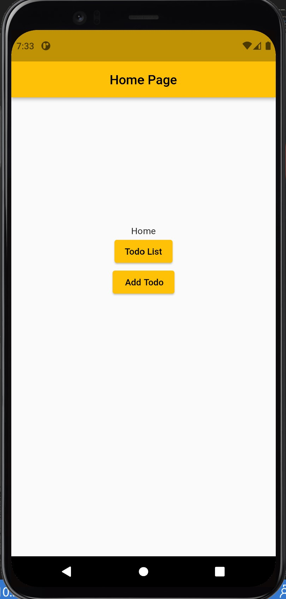
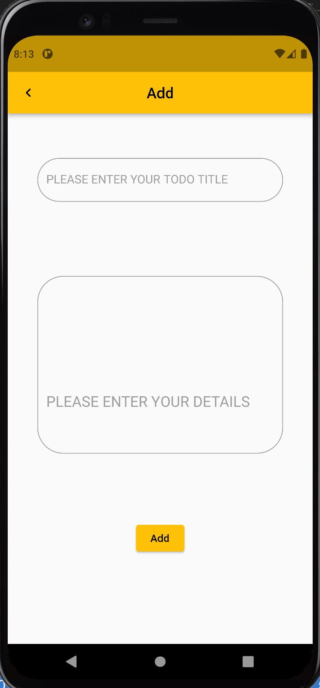
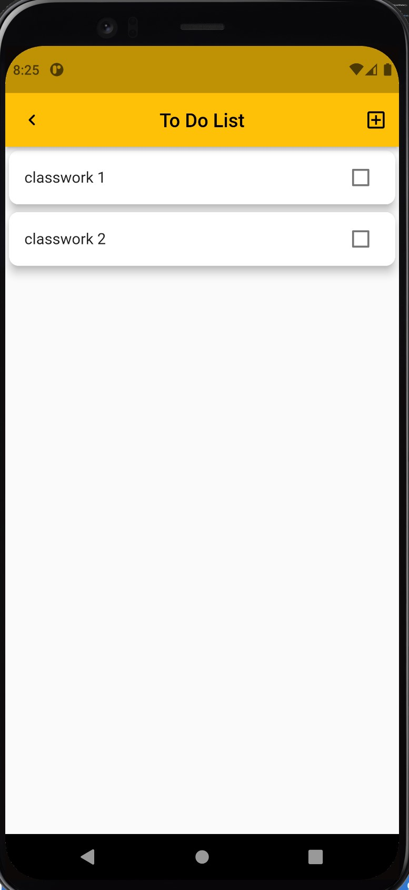
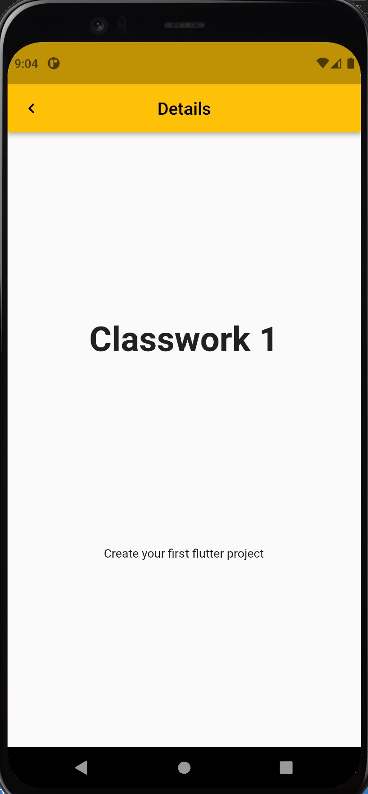

# UC-Flutter-cw-7

## تمرين
احد اصحاب المشاريع الصغيرة يحتاج العون في صنع تطبيق ينظم المهام اليومية له  لذا المطلوب من صنع هذا التطبيق ويجب يحتوي على أربع صفحات:
1. صفحة رئيسة تحتوي ازرار تنقلنا للصفحات الفرعية ( صفحة قائمة المهام - صفحة اضافة مهمة )
* نقوم باضافة Elevated button 2  لكي يقوم كل زر منهم بنقلنا للصفحات المطلوب.

2. صفحة اضافة مهمة مع كامل تفاصيلها.
* نضيف  2 TextFiled widget  من خلالهم نحدد title  المهمة و بعض التفاصيل 
3. صفحة قائمة المهام 
* نقوم باضافة listView من خلالها نقوم باستدعاء title كل مهمة (ملاحظة: مطلوب في حال الضغط على المهمة ننتقل لصفحة تفاصيل المهمة)
4. صفحة تفاصيل المهمة و فيها تعرض كامل تفاصيل المهمة 
* في هذه نضيف Text widget 2 من خلالهم نعرض title  المهمة و كامل تفاصيلها

